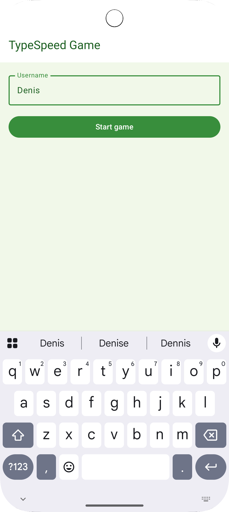
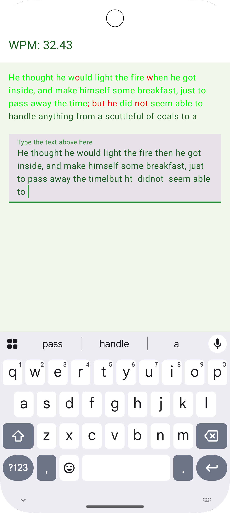
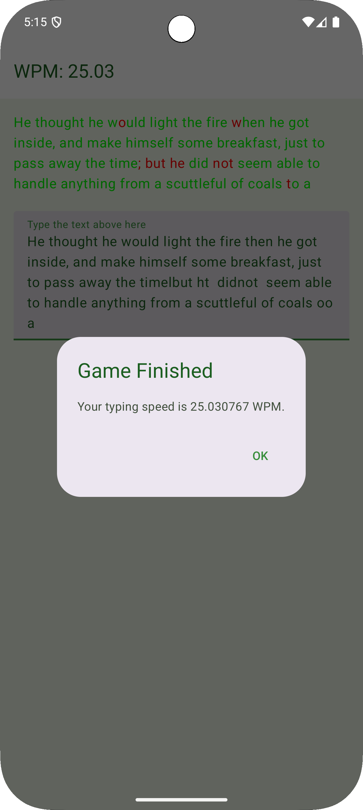

# ThreatFabric Assessment

This project is an Android typing speed test app developed as part of a technical assessment 
for ThreatFabric. It tracks keystrokes, calculates real-time Words Per Minute (WPM) and gathers 
device orientation using Jetpack Compose and Room.

## ✨ Features

-  Real-time WPM calculation based on keystrokes from a Room database. A timer was not implemented
that means that WPM is updating only when user pressing buttons (generates Keystrokes). I decided
to choose a precise approach as it looked more natural and it fits any language. Alternative
approach of calculating WPM is to choose a word length equal to 5 characters and simply divide all
the characters by 5 to get the amount of words. The approach I chose will work fine for English,
Romanian, Dutch and other languages no matter what is an average length of words in that language.
-  Highlights correct and incorrect characters on the paragraph that a user is asked to type in
-  Tracks keypress duration and phone orientation. Not really true as Compose implementation
doesn't allow to receive a standard key events for soft keyboard. And also an implementation of 
onKeyEvent() method from Modifier is not really reliable I was not able to make it work properly
-  Stores analytics with Room Database and also uses Coroutines and Flow to communicate with
the database and throughout the entire application. Isn't it a plus? =)
-  Jetpack Compose UI with Material 3 support. It's both modern and easy to use but also one of
the biggest problem maker of the project
-  Dark and light themes. I created a complete Compose Theme for the application but haven't
configured Typography and Shapes as I had neither time nor energy to do it

## 📸 Screenshots
Game Settings screen where you can enter a user name and start a game (unique UUID will be 
generated for every game to be able to separate records in the database)

The game screen where user is offered to type a paragraph and WPM is calculated in real time,
showing it's value at the top of the screen. Also a feedback is being generated for user to let
him know how many mistakes he made and how much text is left to be done.

When a user is finished with the task a dialog with result WPM is shown and user returned back to 
the first screen where he can start a new game.

## Tech Stack
- Kotlin
- Jetpack Compose
- Jetpack Compose Navigationa
- Room Database
- Coroutines & Flow
- Hilt
- MVVM architecture
- and more...

## How to Run

1. Clone the repository: git clone https://github.com/Axxell/threatfabric_assessment.git
2. Open in Android Studio (Giraffe or later)
3. Sync Gradle and build the project 
4. Run the app on an emulator or physical device

## Analytics

Each key event is recorded with:
- Key code
- Press and release timestamps. Due to compose limitations as described above they're the same
- Separator flag. This flag is used to be able to split initial paragraph and typed paragraph 
with the same separators to equal amount of words 
- Phone orientation (portrait/landscape)
- Character correctness. This flag is used to speed up calculation of the WPM 
- Game session ID and user name

These are stored in a Room database and observed via Flow for real-time updates. I was using
GameKeystrokesStateFlowHolder to store a state flow to be able to share room records with all the
consumers as every time we request for query flow we're missing all the old events.

## Project Structure
📁 app/
├── MainActivity.kt - single activity of the application. 
├── application/
│   └── TypeSpeedApplication.kt - Custom application for Hilt
└── navigation/ - Navigation package for Compose Navigation
    ├── ApplicationNavHost.kt
    └── NavigationRoute.kt
📁 domain-data-typespeed/ 
├── data/ - Lowest layer of app communication
│   ├── converters/ - Converters for Dto to Domain models
│   ├── datasource/ - Local Source (Room database in this case). Can also contain remote data source.
│   └── repository/ - repository implementation manages sources and provides data to usecases
├── di/ - Hilt DI modules
└── domain/ Domain layer
    ├── model/ - domain layer
    ├── repository/ - repository interface
    ├── stateholder/ - custom state holders to extract some logic out from viewmodels/repositories
    ├── usecase/ - usecases for business logic
    └── utils/ - Moved WPM calculation to a separate object WordsPerMinuteCalculator
📁 feature-component-keystroke-tracking-textfield/ - Custom TextField to save Keystrokes
├── model/ - a model to collect and deliver analytics data to convert it to Keystroke later on
├── ui.keyboard/ - TextField with viewmodel with logic to save keystrokes
└── utils/ - Util class that is used to disable backspace button and check keystroke correctness
📁 feature-component-wordsperminute/ - Custom Text view to show WPM
📁 feature-game-screen/ - Composable for a Game Screen
📁 feature-game-setup-screen/ - Composable for a Game Setup Screen
📁 foundation-coroutines/ - Base module that supposed to be used for Coroutines related basic classes
📁 foundation-strings/ - Base module that contains classes related to Strings (StringExtensions)
📁 foundation-ui/ - Base module that contains classes related to UI (Theme files)
